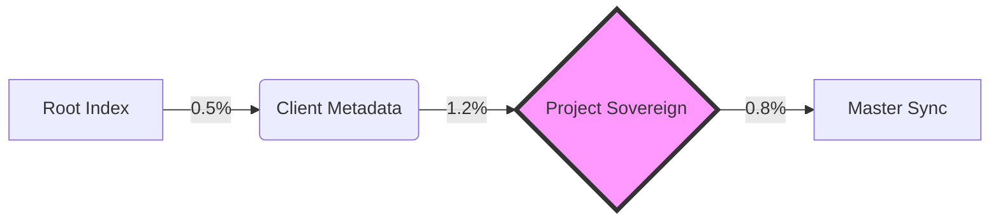

<!-- WIDGET: {
  "widget_id": "token-telemetry",
  "version": "1.0.0",
  "owner_agent": "memory-manager",
  "last_updated": "2026-04-22T02:30:00Z",
  "token_weight": "light",
  "data_source": ".ai/memory/state.json",
  "update_trigger": "composition",
  "lazy_load": true,
  "gate_lock": false
} -->

# 📊 Token-Economy Telemetry (v5.1.0)

> [!IMPORTANT]
> Global Budget Cap: **< 5% session allocation**

| Scope | Session Budget | Current Usage | Delta | Status |
|:---|:---|:---|:---|:---|
| **Root (Master)** | 150K | 2.5K | -0.2K | ✅ STABLE |
| **Client Tier** | 100K | 1.1K | +0.1K | ✅ STABLE |
| **Project Tier** | 250K | 8.4K | +1.2K | ⚠️ GROWTH |

### 📈 Delta-Sync Visualization

---
*Last Sync: 2026-04-22 02:30:00 | Trigger: compose.py*
