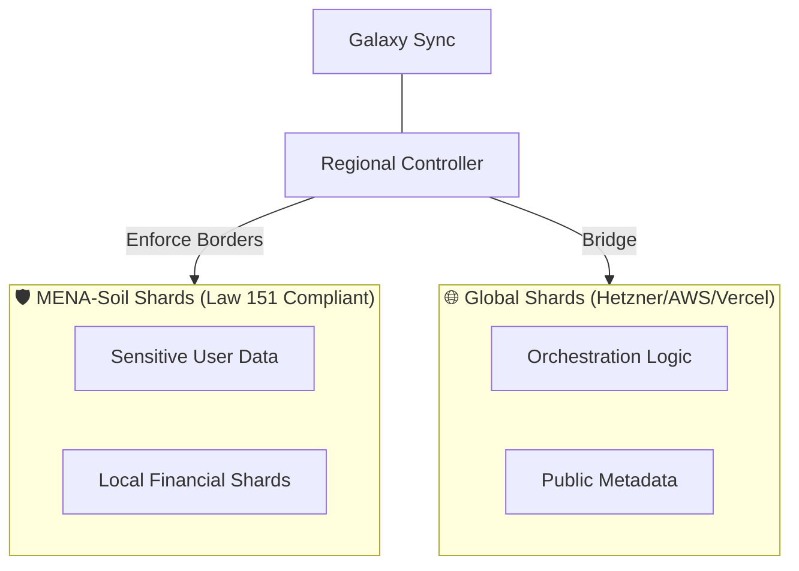
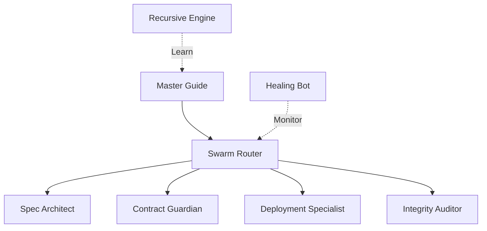
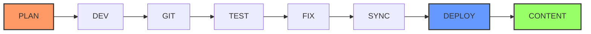

# 🌌 AI Workspace Factory (AIWF) — Sovereign Galaxy v13.0.0

[](https://github.com/iDorgham/Ai-Workspace-Factory-AIWF)
[](https://github.com/iDorgham/Ai-Workspace-Factory-AIWF)
[](https://github.com/iDorgham/Ai-Workspace-Factory-AIWF)
[](https://github.com/iDorgham/Ai-Workspace-Factory-AIWF)
[](https://github.com/iDorgham/Ai-Workspace-Factory-AIWF)
[](https://github.com/iDorgham/Ai-Workspace-Factory-AIWF)
[](https://github.com/iDorgham/Ai-Workspace-Factory-AIWF)
[](https://github.com/iDorgham/Ai-Workspace-Factory-AIWF)
[](https://github.com/iDorgham/Ai-Workspace-Factory-AIWF)

The **AI Workspace Factory** (AIWF) is a powerful, self-thinking system built to create and manage professional software businesses at a massive scale. Think of it like a smart, automated factory that doesn't just build apps, but builds entire digital companies that can run themselves and evolve to get better over time.

We have reached a major milestone called **Geospatial Sovereignty**. This means our system is smart enough to know exactly where your data is allowed to go. If your data needs to stay in a specific country to follow local rules (like the Law 151/2020 data residency laws in the MENA region), the factory locks it safely on local ground. At the same time, it keeps all your different cloud systems perfectly in sync and working together across the globe. You get total local safety combined with world-class performance.



---

## 🏛️ Core Architecture: The Sovereign Pillars

### 1. Regional-Controller (`v13.0`)

**Geospatial Enforcement.** Enforces Law 151/2020 residency protocols, ensuring sensitive data packets remain within sovereign MENA-soil boundaries.

### 2. Galaxy-Sync Engine (`v12.0`)

**Real-time P2P propagation.** Ensures absolute global equilibrium across all cloud shards via an encrypted industrial sync fabric.

### 3. Cloud-Gateway (`v11.0`)

**Multi-Cloud orchestration.** Manage heterogeneous shards across AWS, Hetzner, Vercel, and DigitalOcean via a unified routing layer.

### 4. The Omega Core (`v10.0`)

**Recursive self-monitoring** and autonomous logic evolution. The factory senses its own performance and proposes structural refactors.

### 5. Registry-Guardian (`v10.1`)

**Industrial immune system** that blocks structural drift and ID collisions in the global command library.

### 6. Shadow-Runner Fabric (`v11.0`)
**Headless remote execution.** Distributed nodes that maintain a P2P heartbeat and execute industrial tasks in the cloud.



---

## 🏗️ Industrial Lifecycle
The AIWF operates on a deterministic, recursive development cycle. Each phase must transition through the following industrial gates:



## 🛰️ Industrial Command Suite

### 🛠️ Development & Distribution

| `/plan` | **Blueprint** | **Architectural Blueprinting.** Orchestrates high-density SDD specifications (≥5 specs) to define phase boundaries. |
| `/plan content` | **Discover** | **Content Discovery.** Runs a structured interview with the user to define pages, style, languages, and SEO — then generates a full phase-based content plan. |
| `/plan status` | **Status** | **Structural Audit.** Executes real-time analysis of phase progress and architectural gap identification. |
| `/plan audit` | **Health** | **Industrial Health Scoring.** Triggers deep-component analysis to maintain OMEGA-tier library equilibrium. |
| `/plan release` | **Release** | **Sovereign Handover.** Automates silent versioning, traceability logging, and immutable Git tagging. |
| `/dev` | **Implement** | **Autonomous Implementation.** Executes code generation strictly governed by validated `spec.yaml` contracts. |
| `/git` | **Sovereign** | **Repository Sovereignty.** Manages distributed shard integrity and autonomous version control sequences. |
| `/test` | **Validate** | **Compliance Validation.** Enforces strict contract testing and Law 151/2020 geospatial residency checks. |
| `/fix` | **Heal** | **Recursive Remediation.** Triggers autonomous drift detection and self-healing of dependency paths. |
| `/sync` | **Equilibrium** | **Global Equilibrium.** Propagates registry and memory state across distributed shards via P2P fabric. |
| `/deploy --target=ID` | **Distribute** | **Shard Distribution.** Dispatches shards to heterogeneous cloud infrastructure with residency-aware routing. |
| `/content` | **Creative** | **Creative Assembly.** Orchestrates sitemaps, information architecture, and high-fidelity content for digital assets. |

### 🧠 Intelligence Interface

| Command | Mode | Purpose |
| :--- | :--- | :--- |
| `/guide` | **Pedagogy** | **Recursive Pedagogy.** Synthesizes session memory to provide architectural pattern analysis and deterministic "Next Prompt" recommendations. |
| `/brainstorm` | **Strategy** | **Strategic Ideation.** Orchestrates multi-agent consensus for complex architectural design and prompt-engineering strategies. |

---

## 💡 Industrial Response Logic

The AI Workspace Factory utilizes a **State-Aware Intelligence Loop**. Every autonomous response is structured to maintain industrial momentum:

- **Quantified Execution**: Specific reporting on what was mutated, where it was saved, and the resulting health impact.
- **Next-Prompt Engineering**: Every turn concludes with a **💡 Suggested Next Step**. These are not just suggestions; they are pre-validated commands or prompts designed to transition the factory into its next logical state without ambiguity.

---

## 🚀 The Galaxy Roadmap (v13.0 — v15.0)

- **v13.0 (Phase 8)**: Regional Shard Lockdown (Data Residency).
- **v14.0 (Phase 9)**: Autonomous Revenue (Fintech Gateways).
- **v15.0 (Phase 10)**: Neural Fabric (Local LLM Synthesis).

---

## ⚙️ Quick Start (Sovereign Node)

```bash
# Initialize the Sovereign Fabric
git clone https://github.com/iDorgham/Ai-Workspace-Factory-AIWF.git
cd Ai-Workspace-Factory-AIWF && pip install -r requirements.txt

# Launch the Omega Dashboard
python3 factory/dashboard/omega_tui_lite.py
```

---

*Governor: Dorgham* | *Registry Version: 13.0.0* | *Status: Manifest & Sovereign*
