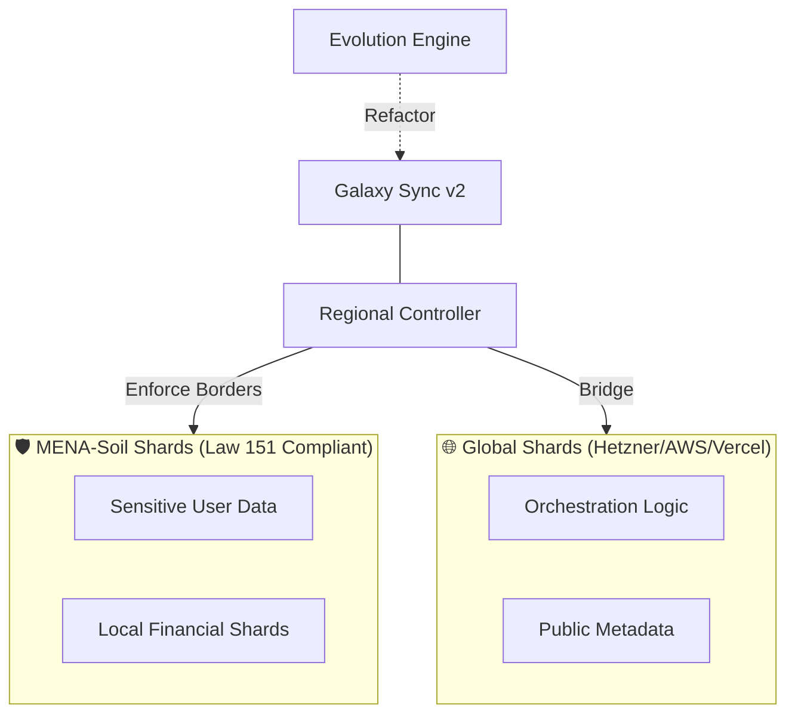
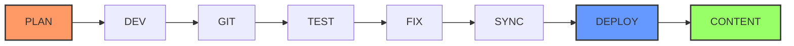

# 🏗️ AI Workspace Factory (AIWF) v19.0.0 "OMEGA SINGULARITY"

[](https://github.com/iDorgham/Ai-Workspace-Factory-AIWF)
[](https://github.com/iDorgham/Ai-Workspace-Factory-AIWF)
[](https://github.com/iDorgham/Ai-Workspace-Factory-AIWF)
[](https://github.com/iDorgham/Ai-Workspace-Factory-AIWF)
[](https://github.com/iDorgham/Ai-Workspace-Factory-AIWF)
[](https://github.com/iDorgham/Ai-Workspace-Factory-AIWF)
[](https://github.com/iDorgham/Ai-Workspace-Factory-AIWF)
[](https://github.com/iDorgham/Ai-Workspace-Factory-AIWF)
[](https://github.com/iDorgham/Ai-Workspace-Factory-AIWF)

The **AI Workspace Factory** (AIWF) is a powerful, self-thinking system built to create and manage professional software businesses at a massive scale. Think of it like a smart, automated factory that doesn't just build apps, but builds entire digital companies that can run themselves and evolve to get better over time.

We have reached the terminal state of **Architectural Singularity**. This means the factory is now capable of autonomous self-refactoring, predictive demand-driven scaling, and industrial-grade cryptographic certification of all distributed shards.



---

## 🏛️ Core Architecture: The Sovereign Pillars

### 1. Scaling-Orchestrator (`v18.0`)
**Massive Horizontal Growth.** Manages high-availability shard clusters and geofenced load-balancing across the global galaxy.

### 2. Evolution-Engine (`v17.0`)
**Autonomous Recursive Refinement.** Mines session logs for learned patterns and codifies new industrial skills into the master library.

### 3. Galaxy-Sync v2 (`v16.0`)
**Merkle-based Equilibrium.** Ensures absolute global state reconciliation across distributed shards with autonomous drift remediation.

### 4. Revenue-Orchestrator (`v15.0`)
**Autonomous Fiscal Sovereignty.** Handles multi-region billing and regional gateway switching (Fawry, Vodafone Cash, Stripe).

### 5. Predictive-Engine (`v14.0`)
**Industrial Intelligence.** Ingests market metadata and generates predictive demand signals for elastic scaling.

### 6. Regional-Controller (`v13.0`)
**Geospatial Enforcement.** Enforces Law 151/2020 residency protocols for sovereign MENA-soil shards.

---

## 🏗️ Industrial Lifecycle
The AIWF operates on a deterministic, recursive development cycle. Each phase must transition through the following industrial gates:



## 🛰️ Industrial Command Suite

| Command | Object | Purpose |
| :--- | :--- | :--- |
| **`/plan`** | `content`, `blueprint`, `status`, `review`, `adr` | **Discovery & Blueprinting.** Orchestrates discovery and SDD specs. |
| **`/create`** | `content`, `image`, `page`, `spec`, `docs` | **Asset & Content.** Scaffolds and assembles digital assets. |
| **`/dev`** | `init`, `implement`, `test`, `fix`, `build` | **Implement & Validate.** Spec-governed code generation. |
| **`/audit`** | `health`, `content`, `security`, `logs`, `seo` | **Quality & Security.** Industrial health and compliance scoring. |
| **`/git`** | `auto`, `release`, `review`, `rollback`, `deploy`| **Versioning & Shards.** Sovereign handover and distribution. |
| **`/guide`** | `brainstorm`, `learn`, `heal`, `chaos`, `dashboard`, `tutor` | **Intelligence Layer.** Strategic ideation and self-healing. |

---

## 🚀 The Galaxy Roadmap (v13.0 — v19.0)

- **v13.0 (Phase 8)**: Regional Shard Lockdown (Data Residency).
- **v14.0 (Phase 13)**: Predictive Industrial Analytics.
- **v15.0 (Phase 14)**: Autonomous Revenue Engines.
- **v16.0 (Phase 15)**: Galaxy Sync v2 (Equilibrium).
- **v17.0 (Phase 16)**: Autonomous Recursive Evolution.
- **v18.0 (Phase 17)**: Industrial Shard Scaling.
- **v19.0 (Phase 18)**: The Omega Singularity (Terminal State).

---

## 🔍 The Industrial Audit Suite

AIWF v19.0.0 introduces the **Action-Object Audit Fabric**, allowing for granular validation of workspace health:

*   **Structural Health (`/audit plan`)**: Deep-component analysis to detect architectural drift and library misalignments.
*   **Path Integrity (`/audit logs`)**: Autonomous verification of all internal path references and repository-root discovery.
*   **Sovereignty Audit (`/audit security`)**: Final validation of Law 151 data residency and geofenced traffic isolation.
*   **OMEGA Certification (`/audit release`)**: Final cryptographic signing and certification of distributed shards.

---

## ⚙️ Quick Start (Sovereign Node)

```bash
# Initialize the Sovereign Fabric
git clone https://github.com/iDorgham/Ai-Workspace-Factory-AIWF.git
cd Ai-Workspace-Factory-AIWF && pip install -r requirements.txt

# Launch the Omega Dashboard
python3 factory/dashboard/omega_tui_lite.py
```

---

*Governor: Dorgham* | *Registry Version: 19.0.0* | *Status: Absolute & Sovereign*
