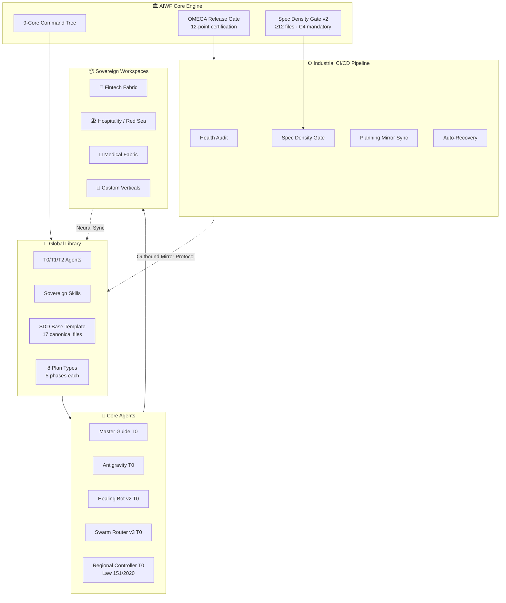
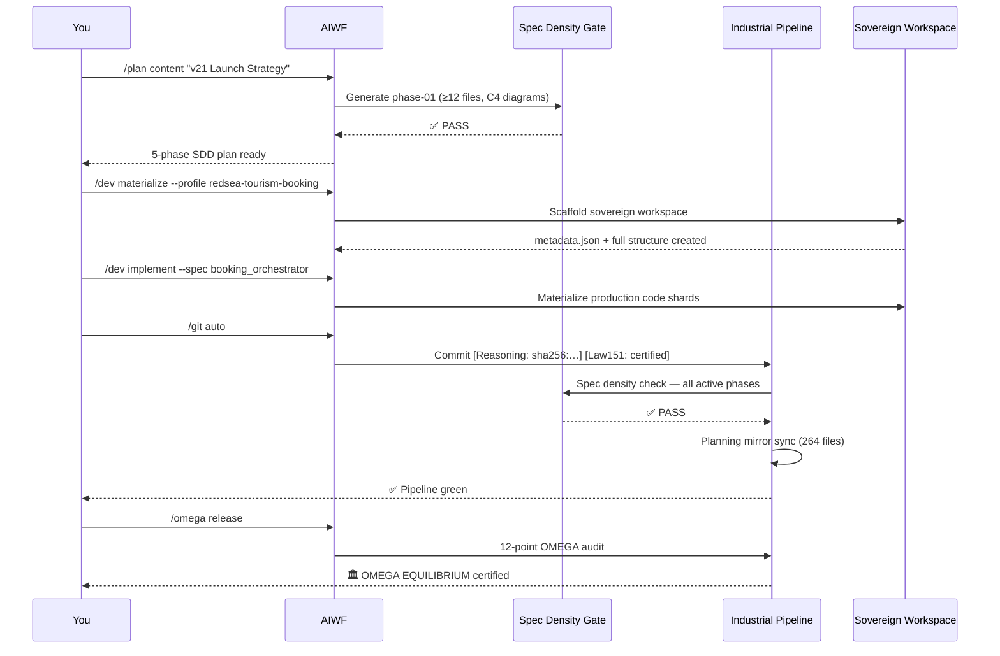

<div align="center">

# 🏛️ AI WORKSPACE FACTORY


<br/><br/>

### *Sovereign Intelligence. Absolute Equilibrium.*

**Materialize · Govern · Scale**

> An industrial-grade AI orchestration engine that builds, governs, and scales  
> sovereign digital verticals — from a single command to a production-ready ecosystem.

[📖 PRD](docs/PRD.md) · [🗺️ Long-Term Roadmap](docs/ROADMAP_LONGTERM.md) · [🎮 Guide Reference](.ai/commands/guide_humanize.md) · [⚙️ Changelog](.ai/logs/)

</div>

---

## 🧭 What is AIWF?

**New to AI tools?** Think of AIWF as a smart factory for software. You describe what you need to build — a fintech platform, a Red Sea tourism booking system, a medical records app — and AIWF generates the entire project structure, governance rules, compliance checks, content strategy, and deployment pipeline. Automatically. Under your control.

**For experienced engineers:** AIWF is a self-learning neural orchestration engine that implements Spec-Driven Development (SDD) with density-gated phases, C4 architecture diagrams, multi-CLI adapter routing (Claude/Gemini/Qwen/Kilo), sovereign Git ops, and a Law 151/2020 compliance layer — all wired into a single authoritative command tree.

### ✨ The Core Promise

```
One command → A fully spec'd, compliant, production-ready sovereign workspace

AIWF v20.1.0 introduces the **Industrial OS Galaxy** — 6 specialized, OMEGA-certified workspace templates that can be materialized in seconds via the root `materialize.sh` engine.

---

## 🔑 Key Features

| Feature | What It Means for You |
|---------|----------------------|
| 🏛️ **Sovereign Workspaces** | Every project is fully isolated, self-governing, and region-compliant — your data never leaves your jurisdiction without explicit approval |
| 🧠 **Neural Fabric Sync** | AI agents communicate and synchronize state across all your projects in real time |
| 🔒 **Law 151/2020 Built-In** | Egypt/MENA data residency enforcement is wired into the architecture — PII geofencing, anonymisation, and audit trails are automatic |
| 📐 **Spec Density Gate** | Every plan phase must have ≥12 spec files and mandatory C4 diagrams before it can proceed — no thin specs, ever |
| 🤖 **Multi-CLI Orchestration** | The same blueprint runs on Claude, Gemini, Qwen, Kilo, OpenCode — each adapter auto-assigned by task type |
| ⚡ **Tripartite Planning** | 8 plan types all sharing the same industrial-grade SDD structure — from dev sprints to content campaigns |
| 🔗 **Reasoning Hash Traceability** | Every commit, spec, and mutation is signed with a deterministic `sha256` hash — full audit trail from idea to deploy |
| 🛡️ **Self-Healing Architecture** | Healing Bot v2 detects structural drift and auto-remediates within 100ms |
| 🚀 **12-Point OMEGA Release Gate** | No version ships without passing mirror drift, path integrity, residency, traceability, and 8 other certification checks |
| 🌐 **P2P Node Engine** | Factory-internal peer discovery and secure component exchange across nodes |

---

## 🏗️ Architecture



### 📁 Three-Tier Directory Structure

```
AIWF/
├── .ai/                          ← 🧠 Metadata & Intelligence Layer
│   ├── agents/                   ← Agent registry, routing map, sub-agent contracts
│   ├── commands/                 ← 9-core command specs (guide, dev, plan, git…)
│   ├── governance/               ← Versioning policy, SDD protocols, compliance
│   ├── plan/                     ← Active plans: 8 types × 5 phases × ≥12 files
│   │   ├── _manifest.yaml        ← Phase registry + planning system block
│   │   ├── templates/sdd/        ← Canonical 17-file base template
│   │   ├── development/          ← Phases 1–23 (sovereign git ops, neural fabric…)
│   │   ├── content/              ← 5-phase content strategy plans
│   │   └── [seo|social_media|    ← 6 additional plan types
│   │        marketing|business|
│   │        media|branding]/
│   └── logs/                     ← Audit logs, deployment traces, health reports
│
├── factory/                      ← 🏭 Core Engine & Scripts
│   ├── core/                     ← P2P node, factory manager, healing bot, neural sync
│   ├── scripts/
│   │   ├── core/                 ← spec_density_gate_v2, planning_mirror_sync,
│   │   │                             omega_release_gate, pre_commit_gate, chain_executor
│   │   ├── automation/           ← saas_scaffolder, workspace provisioner
│   │   └── maintenance/          ← health_scorer, chaos_validator, log_broadcaster
│   ├── library/                  ← Shared agents, skills, templates, planning mirror
│   └── profiles/                 ← 20+ industry workspace profiles
│
└── workspaces/                   ← 📦 Sovereign Client Environments
    ├── templates/                ← 🌌 Industrial OS Shards (v20.1)
    │   ├── CORE_OS_SAAS/         ← Full-Stack SaaS Factory
    │   ├── MOBILE_OS_FORGE/      ← High-Performance Mobile Forge
    │   ├── WEB_OS_TITAN/         ← Web & Content Dominance Shard
    │   ├── MENA_OS_BILINGUAL/    ← Ar/En Regional SEO Engine
    │   ├── ASSET_OS_LAB/         ← GenAI Visual Production Lab
    │   └── BRAND_OS_STRATEGY/    ← Industrial Brand Engine
    ├── clients/{slug}/           ← Professional project sharding
    └── personal/                 ← Private innovation layer
```

---

## 🏢 Supported Industries & Verticals

> **What is a "sovereign workspace"?** It's a fully self-contained project environment — with its own agents, compliance rules, data residency, and governance — that can operate independently of any cloud provider or external service.

| Vertical | Profile | Key Capabilities |
|---------|---------|-----------------|
| 🏦 **Fintech Fabric** | `fintech-compliance-launch` | Fawry/Vodafone Cash/Meeza, VAT 14% engine, SHA-256 financial shards, sovereign PII vault |
| 🏖️ **Red Sea Tourism** | `redsea-tourism-booking` | Real-time inventory sync, USD↔EGP routing, 29% hospitality tax stack, dive certificates |
| 🏨 **Hospitality Ops** | `hospitality-restaurant-ops` | Multi-currency guest ledgers, property management, MENA tax orchestration |
| 💊 **Medical / Pharmacy** | `medical-pharmacy-ops` | Pharmacy tax engine, sovereign medical PII, MENA healthcare compliance |
| 🎨 **Branding Agency** | `agency-branding-identity` | Brand voice system, 8-type content planning, multi-channel distribution |
| 🎬 **Cinematic Production** | `cinematic-video-production` | Media planning, content strategy, SEO-optimized distribution |
| ☁️ **Cloud Architecture** | `cloud-architecture` | Multi-cloud sovereign deployment, MENA residency nodes, IaC |
| 🤖 **AI Automation Lab** | `ai-automation-lab-pro` | Multi-agent orchestration, recursive skill synthesis, tool-performance ledger |
| 📢 **Advertising Suite** | `advertising-performance-suite` | Campaign planning, performance reporting, competitive intelligence |
| 🌌 **suber_saas_template** | `suber-saas-template-premium` | Next.js 15 App Router, shadcn/ui Design System, Framer Motion, Law 151 |
| ⚖️ **Legal Tech** | *(custom profile)* | Law 151/2020 + PDPL (KSA) compliance auditors, contract governance |

---

## 🎮 The 9-Core Authoritative Command Tree

> Every command supports a `help` subcommand. Run `/guide help`, `/dev help`, `/plan help` etc. for the full reference.

| Command | Core Subcommands | Workflow | Description |
|---------|-----------------|---------|-------------|
| 🧭 **`/guide`** | `dashboard` · `learn` · `chaos` · `tutor` · `brainstorm` · `heal` · `plan [type]` · `spec [topic]` · `gate [path]` · `adapter [task]` · `memory:view` | Oversight & Learning | Antigravity intelligence layer. Humanized guidance, v21 planning intelligence, CLI adapter routing. |
| 🏭 **`/dev`** | `materialize` · `implement` · `build` · `deploy` · `archive` | Full Lifecycle | End-to-end workspace lifecycle: scaffold → code → package → deploy → seal. |
| 📐 **`/plan`** | `blueprint` · `audit` · `[type] "[topic]"` | Planning | Generate sovereign SDD blueprints for any of 8 plan types. Density gate enforced automatically. |
| 🔧 **`/factory`** | `repair` · `sync` · `assign` · `maintain` | Factory Health | Core engine maintenance: repair drift, sync library, assign swarm tasks. |
| 📚 **`/library`** | `check` · `fix` · `promote` · `help` | Library Governance | Manage the global component library, validate contracts, promote workspace skills. |
| 🔗 **`/git`** | `auto` · `commit` · `push` · `tag` · `release` | Sovereign Git Ops | Governed git operations with reasoning hash, Law 151 certification, FSM chain executor. |
| 🛡️ **`/audit`** | `health` · `security` · `compliance` · `12-point` | Audit & Compliance | Run any subset of the 12-point OMEGA audit. Includes Law 151/2020 residency checks. |
| 🌐 **`/sync`** | `--all` · `--workspace [slug]` · `--type [plan-type]` | Neural Sync | Propagate library updates to workspaces; mirror plan types to factory library. |
| ♾️ **`/omega`** | `status` · `release` · `gate` · `singularity` | OMEGA Control | Singularity status, release certification, and factory evolution control. |

### `/guide` Planning Intelligence — Quick Reference (v21)

```bash
/guide ping                                              # Activation check — shows v3.0/v21 context
/guide plan content                                      # SDD lifecycle for content planning type
/guide plan status                                       # Active phases + density gate status
/guide spec "AI governance layer"                        # ≥12-item spec outline + reasoning hash
/guide gate .ai/plan/content/phase-03-detailed-design   # Gate result explanation + fix guidance
/guide adapter "Arabic LinkedIn post"                    # → qwen + Law 151 anonymisation required
/guide brainstorm about [topic]                          # 3 creative directions A/B/C
/guide mode:critic                                       # Switch tone profile
/guide help                                              # Full command tree
```

---

## ⚡ Installation & Quick Start

### Requirements

- **Python** 3.10 or higher
- **Git** with SSH access configured
- **OS**: Linux or macOS (Ubuntu 22.04+ recommended for CI)

### 1 — Clone & Enter

```bash
git clone https://github.com/your-org/AIWF.git
cd AIWF
export PYTHONPATH=$PYTHONPATH:.
```

### 2 — Verify Health

```bash
python3 factory/scripts/maintenance/health_scorer.py
# Expected: Industrial Health Score: 100/100
```

### 3 — Materialize Your First Workspace

```bash
# Scaffold a new sovereign workspace (e.g. Red Sea tourism)
python3 factory/scripts/automation/saas_scaffolder.py "My-Resort"

# Verify sovereign structure was created
ls workspaces/clients/my-resort/
# metadata.json  .ai/  docs/  src/
```

### 4 — Run the Spec Density Gate

```bash
python3 factory/scripts/core/spec_density_gate_v2.py \
    --phase .ai/plan/content/phase-01-discovery
# Expected: EXIT 0 — all gates PASS
```

### 5 — Sync the Planning Library

```bash
# Mirror all active plans → factory/library/planning/
python3 factory/scripts/core/planning_mirror_sync.py

# Or a single type
python3 factory/scripts/core/planning_mirror_sync.py --type content --dry-run
```

### 6 — 12-Point OMEGA Certification

```bash
python3 factory/scripts/core/omega_release_gate.py --all
# Expected: OMEGA EQUILIBRIUM — 12/12 gates PASS
```

### First Commands to Explore

```bash
/guide ping                             # Confirm Antigravity is active
/guide plan development                 # See the development SDD lifecycle
/plan blueprint --from 00-foundation    # Start a new development blueprint
/audit health                           # Check ecosystem health score
/guide brainstorm about [your idea]     # 3-direction creative exploration
```

---

## 🔄 The Industrial Lifecycle



---

## 🛡️ Compliance & Sovereignty

### Law 151/2020 — Egypt Data Protection

AIWF is built around Egyptian Law 151/2020 (the Personal Data Protection Law). This isn't an add-on — it's wired into the architecture at every layer:

| Control | Implementation |
|---------|---------------|
| **Data Residency** | All MENA data stays on `MENA-SOIL-EGY-01` (aws:me-central-1) |
| **PII Geofencing** | `regional_controller_bridge` agent enforces geospatial locks on every mutation |
| **Arabic Content** | Arabic tasks route to Qwen + mandatory Law 151 anonymisation checklist |
| **Audit Trail** | Every mutation: ISO-8601 timestamp + `sha256` reasoning hash |
| **Pre-push Gate** | `push_gate.py` validates residency before every `git push` |
| **Phase Compliance** | Every SDD phase contains `regional_compliance.md` |

### The Reasoning Hash

Every commit and spec output carries a deterministic traceability signature:

```
feat(content): add phase-03 detailed design
[Reasoning: sha256:591f4801ce2127b9] [Law151: certified]
```

### The 12-Point OMEGA Audit

| # | Gate | Threshold |
|---|------|-----------|
| 1 | Mirror Drift | 0.00% |
| 2 | Path Integrity | No root pollution |
| 3 | Data Residency | Law 151 geofencing active |
| 4 | Reasoning Hash Coverage | 100% of commits |
| 5 | Spec Density | ≥12 files per non-draft phase |
| 6 | C4 Diagrams | Context + Container present in every phase |
| 7 | Naming Convention | 100% `snake_case` |
| 8 | Agent Registry | No ID collisions |
| 9 | Pre-commit Hook | Installed and active |
| 10 | Planning Mirror | Sync manifest current |
| 11 | Swarm Locks | No stale mutex files |
| 12 | Industrial Health | Score ≥ 95/100 |

---

## 🗺️ Roadmap

| Version | Codename | Status | Headline |
|---------|---------|--------|---------|
| v19.x | Sovereign Commit | ✅ Complete | Pre-commit hook, reasoning hash, FSM chain executor |
| v20.0 | OMEGA Equilibrium | ✅ Complete | 12-point gate, sovereign git ops, geofencing, swarm safety |
| **v21.0** | **Neural Fabric** | ✅ **Current** | **Tripartite Planning Singularity, 8 plan types, density gate v2, multi-CLI** |
| v22.0 | COSMIC ANCHOR | 🏗️ Planned | Multi-cloud autonomy, distributed P2P library, quantum-safe encryption |
| v23.0 | NEURAL BRIDGE | 🔭 Research | Factory-as-a-Service, zero-draft PRD, 60-second workspace |
| v24.0 | GALAXY SWARM | 🌌 Vision | Cross-instance P2P sync, infinite context engine, agent bidding |
| v30+ | OMEGA SINGULARITY | 🌌 Long-term | Self-architecting core, market-aware synthesis, zero-human operations |

→ **[Full Long-Term Roadmap (v22→v30+) →](docs/ROADMAP_LONGTERM.md)**

---

## 🤝 Contributing & Governance

AIWF operates under a **Sovereign Commit Protocol**. All contributions must:

1. Pass the pre-commit gate (`snake_case` enforcement, no `TODO_P_L_A_C_E_H_O_L_D_E_R`, mirror drift < threshold)
2. Carry a reasoning hash in the commit message
3. Include a Law 151/2020 certification flag for MENA-touching changes
4. Pass spec density gate on all modified plan phases (exit code 0)

```bash
# Correct sovereign commit format:
feat(content): add phase-04 tasks and contracts [Reasoning: sha256:abc123] [Law151: certified]
```

Workspace-to-library promotions require 3-agent consensus + governor approval via `/library promote`.

---

<div align="center">

---

🏛️ **AI Workspace Factory** · v20.1.0 · OMEGA EQUILIBRIUM

Governor: **Dorgham** · Compliance: **Law 151/2020** · Region: **MENA-SOIL**

*[PRD](docs/PRD.md) · [Long-Term Roadmap](docs/ROADMAP_LONGTERM.md) · [Guide Reference](.ai/commands/guide_humanize.md)*

**Sovereign Intelligence. Absolute Equilibrium.**

</div>
