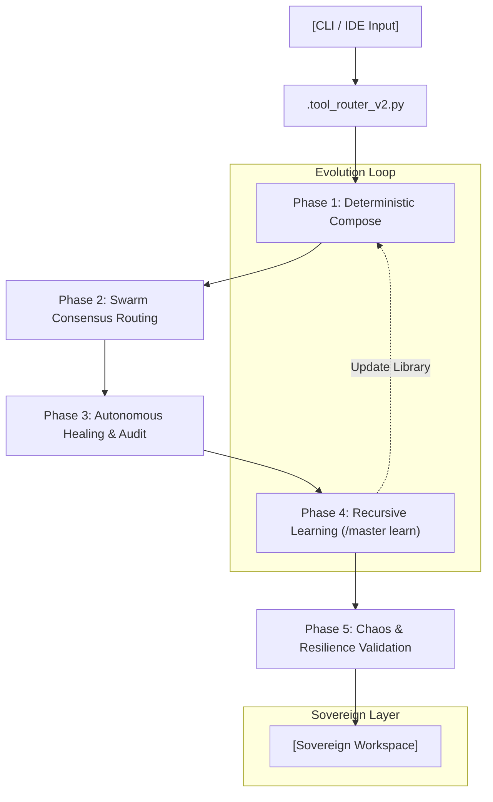

# 🏭 AI WORKSPACE FACTORY (AIWF)
### *The Antifragile Sovereign Composition Engine*

[](file:///Users/Dorgham/Documents/Work/Devleopment/AIWF/master/docs/Product%20required%20document/AIWF-PRD.md)
[](#)
[](#)

---

## 🌟 OVERVIEW

**AI Workspace Factory (AIWF)** is a state-of-the-art composition engine designed to industrialize the creation and evolution of AI-native workspaces. Moving beyond simple prompt-based generation, AIWF v6.0.0 introduces **Antifragility**—a system that doesn't just resist stress but actively improves from it.

By leveraging a **Library-First** philosophy, AIWF assembles client-specific environments from curated, versioned components, ensuring deterministic outputs, sovereign isolation, and recursive architectural evolution.

---

## 🏗️ THE ANTIFRAGILE PILLARS (v6.0.0)

Version 6.0.0 represents a quantum leap in autonomous resilience. The system is built on four core pillars that enable self-evolution and proactive healing.

| Pillar | Agent / System | Function |
| :--- | :--- | :--- |
| **Autonomous Healing** | `Healing Bot` | Monitors structural integrity and auto-remediates drift using append-only repair logs. |
| **Recursive Learning** | `/master learn` | Converts user corrections and pipeline feedback into permanent, versioned skill manifests. |
| **Swarm Consensus** | `Swarm Router v3` | Orchestrates critical paths through multi-agent validation, preventing single-point logic failures. |
| **Chaos Scaffolding** | `Chaos Validator` | Injects controlled stressors to verify isolation boundaries and adaptive recovery rates. |

---

## 📊 CORE ARCHITECTURE

AIWF operates as a multi-phase pipeline that transforms client requirements into production-ready sovereign workspaces.



---

## 🛠️ REPOSITORY STRUCTURE

```text
AIWF/
├── .ai/                    # System memory, agents, and autonomous logs
├── docs/                   # Strategic planning, PRDs, and playbooks
│   └── Product required document/AIWF-PRD.md
├── factory/                # The Composition Engine
│   ├── library/            # Canonical, versioned components
│   ├── profiles/           # Blueprint configurations for workspaces
│   └── scripts/            # Core automation and validation logic
├── master/                 # Project core and master contexts
├── workspaces/             # Factory-generated client environments (isolated)
└── scripts/                # Root-level utility and maintenance scripts
```

---

## 🚀 COMMAND CENTER

AIWF provides a powerful CLI interface for operators to manage the entire lifecycle of a workspace.

| Command | Tier | Description |
| :--- | :--- | :--- |
| `/master learn` | T0 | Triggers the Recursive Learning Engine to update skill manifests. |
| `/heal check --auto` | T0 | Executes the Healing Bot to audit and fix structural drift. |
| `/route consensus` | T0 | Runs the Swarm Router for multi-agent strategy validation. |
| `/chaos inject` | T1 | Injects stressors to test the resilience of a specific workspace. |
| `/dashboard --root` | T1 | Renders the Antifragile Dashboard with real-time stress metrics. |

---

## 🛡️ GOVERNANCE & THE OMEGA GATE

Safety and sovereignty are hardcoded into the AIWF DNA. All autonomous mutations are governed by the **Omega Gate**:

- **Human-Mediated Approval**: Structural or library changes require an explicit `Dorgham-Approval` flag.
- **Traceable Logs**: Every action is stamped with an ISO-8601 timestamp, a unique Reasoning Hash, and a rollback pointer.
- **Sovereign Isolation**: Client workspaces in `workspaces/` are 100% independent; cross-project writes are strictly forbidden without high-tier consensus.

---

## 📈 TECHNICAL SPECIFICATIONS

- **Token Efficiency**: Target session overhead `< 2.5%` via Context Compression (95).
- **Reliability**: `99.8%` routing precision with deterministic fallback.
- **Resilience**: `95%+` recovery success rate under Chaos Scaffolding stress tests.
- **Compliance**: Full alignment with MENA ethics (AAOIFI/IFSB) and DLD standards.

---

> [!NOTE]
> AIWF is a living system. Architectural improvements are committed as append-only records to ensure a perfect audit trail and total reversibility.

---

**Built by [Dorgham]** | *v6.0.0 "Antifragile Factory"*
