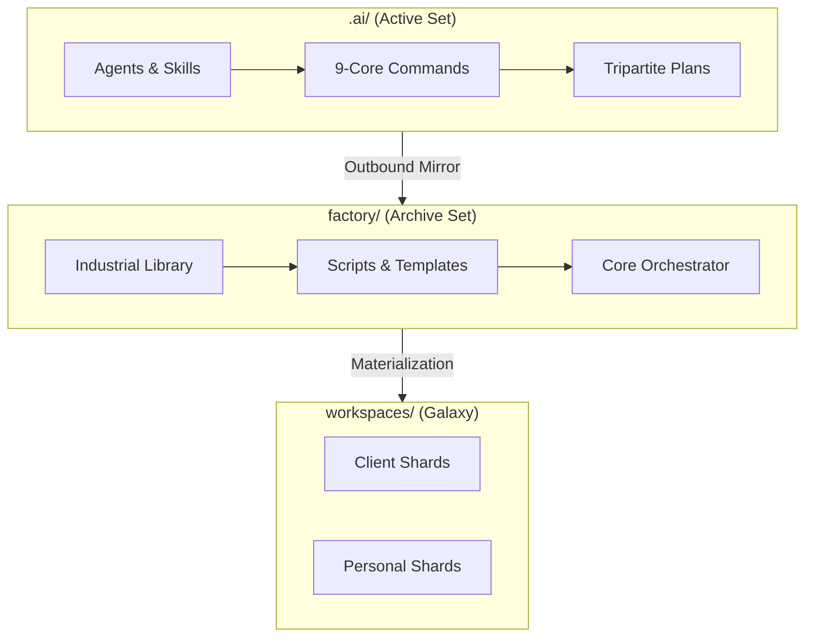

<div align="center">
  

  # 🌌 AI Workspace Factory (AIWF)
  ### **The Sovereign Industrial Engine for OMEGA-Tier Orchestration**

  [](https://github.com/iDorgham/Ai-Workspace-Factory-AIWF)
  [](https://github.com/iDorgham/Ai-Workspace-Factory-AIWF)
  [](https://github.com/iDorgham/Ai-Workspace-Factory-AIWF)
  [](https://github.com/iDorgham/Ai-Workspace-Factory-AIWF)
</div>

---

## 🏛️ Overview
The **AI Workspace Factory (AIWF)** is a professional-grade, multi-agent industrial ecosystem designed to scaffold, govern, and evolve sovereign development environments. Operating under the **v20.0.0 OMEGA EQUILIBRIUM** standard, the factory enables high-velocity project materialization with absolute technical equilibrium and geospatial data residency.

## 🚀 Key Features

### 🛠️ 9-Core Authoritative Command Tree
Unified terminal operations governed by specialized T0 orchestrators.
- **`/factory`** & **`/library`**: Lifecycle and component stewardship.
- **`/plan`** & **`/create`**: High-density SDD blueprinting.
- **`/dev`** & **`/git`**: Industrial implementation and versioning.
- **`/do`**, **`/guide`**, **`/audit`**: Swarm routing, intelligence, and health.

### 📐 Tripartite SDD Planning
Advanced planning methodology segregating technical and strategic streams:
- **Development**: Technical architecture and infrastructure.
- **Content**: SEO, legal, and strategic copywriting.
- **Social**: Brand-voice distribution and social media orchestration.

### 🕵️ Structural Integrity & Mirroring
- **Active-Set Sync**: Real-time outbound mirroring from `.ai/` to the industrial library.
- **Naming Unification**: Strict `snake_case` enforcement across all shards.
- **Link Remediation**: Automated detection and repair of path decay.

## 🏗️ Sovereign Architecture



## 🛡️ Industrial Compliance
- **Law 151/2020**: Enforces Egyptian geospatial data residency rules for all client shards.
- **Omega Gate v2**: Multi-agent consensus protocol for project certification.
- **ISO-8601**: Standardized traceability and reasoning logs.

## 📈 Quick Start
```bash
# Initialize project discovery
/factory start <project_name>

# Generate high-density blueprint
/plan blueprint --type=dev

# Materialize workspace
/factory make <project_name>
```

---
<div align="center">
  <sub>Governor: <b>Dorgham</b> | Standard: <b>v20.0.0 OMEGA</b> | Industrialized by <b>Antigravity</b></sub>
</div>
