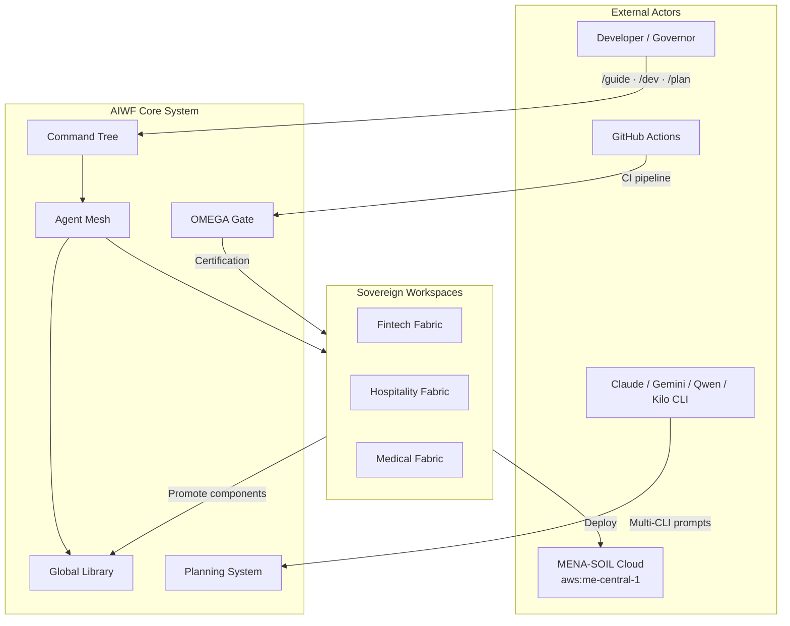

# 🏛️ AIWF — Product Requirements Document
## AI Workspace Factory · v20.1.0 OMEGA EQUILIBRIUM

**Document Type:** Comprehensive PRD — Self-Contained Reconstruction Reference  
**Version:** 20.1.0  
**Status:** OMEGA CERTIFIED  
**Governor:** Dorgham  
**Created:** 2026-04-25  
**Updated:** 2026-04-29  
**Traceability Hash:** sha256:prd-v20-1-final-2026-04-29  
**Compliance:** Law 151/2020 — Egypt/MENA Data Residency Enforced  

> **Purpose of this document:** A self-contained, high-fidelity PRD sufficient for another AI agent or engineering team to reconstruct the AIWF project from scratch with full fidelity. Every protocol, agent, architecture decision, and acceptance criterion is documented here.

---

## Table of Contents

1. [Executive Summary & Vision](#1-executive-summary--vision)
2. [Historical Evolution & Version Timeline](#2-historical-evolution--version-timeline)
3. [Core Architecture — Three-Tier System](#3-core-architecture--three-tier-system)
4. [Key Protocols](#4-key-protocols)
5. [Agent Registry](#5-agent-registry)
6. [9-Core Command Tree](#6-9-core-command-tree)
7. [Tripartite SDD Planning System](#7-tripartite-sdd-planning-system)
8. [Git Ops & CI/CD Sovereignty (Phases 19–23)](#8-git-ops--cicd-sovereignty-phases-1923)
9. [Fix Vectors & Structural Integrity](#9-fix-vectors--structural-integrity)
10. [Compliance & Sovereignty Framework](#10-compliance--sovereignty-framework)
11. [Tech Stack & Implementation Details](#11-tech-stack--implementation-details)
12. [Success Metrics & Audit Standards](#12-success-metrics--audit-standards)
13. [Acceptance Criteria — How to Verify Equilibrium](#13-acceptance-criteria--how-to-verify-equilibrium)

---

## 1. Executive Summary & Vision

### 1.1 What is AIWF?

The **AI Workspace Factory (AIWF)** is a sovereign, autonomous, industrial-grade AI orchestration engine. It materializes, governs, and scales production-ready digital verticals — from fintech platforms to Red Sea tourism systems to medical applications — while enforcing strict technical equilibrium and regional compliance (Law 151/2020) across all distributed components.

AIWF is not a code generator. It is a **self-learning neural factory** that:
- Maintains a global library of pre-certified agents, skills, and templates
- Provisions isolated sovereign workspaces for each client/project
- Enforces high-density specification discipline before any code is written
- Routes generation tasks to the optimal CLI adapter (Claude/Gemini/Qwen/Kilo/OpenCode)
- Governs the entire lifecycle from initial brief through deployment and compliance certification

### 1.2 Core Design Philosophy

| Principle | Expression |
|-----------|-----------|
| **Sovereignty First** | Data never crosses jurisdiction without explicit gate clearance |
| **Spec Before Code** | No implementation without ≥12 spec files, C4 diagrams, and density gate PASS |
| **Append-Only Truth** | No overwriting history — every mutation is traceable via reasoning hash |
| **Antifragility** | Chaos Validator proactively stress-tests before any failure occurs |
| **Industrial Precision** | Mathematical certainty in tax, financial, and compliance logic |
| **OMEGA Equilibrium** | System state where all 12 audit gates pass simultaneously |

### 1.3 Vision Statement

> *"A world where any builder — regardless of technical depth — can materialize a sovereign, compliant, production-ready digital vertical from a single authoritative intent. The factory thinks in systems. The human thinks in outcomes."*

---

## 2. Historical Evolution & Version Timeline

### 2.1 Version Table

| Version | Codename | Date | Status | Key Shift |
|---------|---------|------|--------|-----------|
| v1–v5 | Genesis | 2024 | Archived | Initial CLI scaffolding, basic workspace concept, manual everything |
| v6.0 | Antifragile | Early 2025 | Archived | Chaos Validator introduced; first agent registry; snake_case enforcement |
| v7.0 | Sovereign Orchestrator | 2025 | Archived | Library-First architecture; Omega Gate v1; first MENA compliance layer |
| v7.2 | Sovereign Sync | 2026-04-23 | Complete | Hot-Sync Engine (`/sync`); workspace debt resolution; Law 151 auditor |
| v7.5 | Omega Dashboard | 2026-04-23 | Complete | Industrial TUI dashboard; parallel swarm operations; Omega Gate v2 |
| v8.0 | Headless Factory | 2026-04-23 | Complete | SaaS Factory-as-a-Service; GitHub Actions headless execution; zero-draft PRD |
| v9.0 | Distributed Swarm | 2026-04-23 | Complete | P2P peer discovery; cross-instance library sync; infinite context sharding |
| v10.0 | Omega Engine | 2026-04-23 | Complete | Self-architecting core; market-aware synthesis; first Omega Singularity model |
| v11.0 | Multi-Cloud | 2026-04-23 | Pending | Multi-cloud orchestration; MENA-SOIL node routing |
| v12.0 | Galaxy Sync | 2026-04-23 | Pending | Galaxy Sync Engine; cross-shard state replication |
| v13.0 | Sovereign Galaxy | 2026-04-23 | Complete | Regional shard lockdown; 8-domain library organization; 965 library nodes |
| v14.0 | Predictive Analytics | 2026-04-23 | Complete | Predictive industrial analytics; autonomous revenue engines |
| v15.0 | Neural Fabric | 2026-04-23 | Active | Neural Sync Agent; cross-workspace skill propagation; recursive synthesis |
| v16–v18 | Governance & Integrity | 2026-04-25 | Complete | Governance phase; 5-vector fix plan; structural integrity hardening |
| v19.x | Sovereign Commit | 2026-04-25 | Complete | Pre-commit gate; reasoning hash; 3-step FSM commit chain |
| v20.0 | OMEGA Equilibrium | 2026-04-25 | Complete | 12-point release gate; sovereign git ops; geofencing; swarm mutex safety |
| **v20.1** | **Industrial Shards** | **2026-04-29** | **Current** | **Industrial shard spawning; `.ai/scripts/factory_materialize.sh` + `/mat`; 6-template OS galaxy** |
| v21.0 | Neural Fabric | Planned | Pipeline | Tripartite Planning Singularity; 8 plan types; spec_density_gate_v2 |
| v22.0+ | Quantum Sovereignty | Future | Planned | See [ROADMAP_LONGTERM.md](ROADMAP_LONGTERM.md) |

### 2.2 Architectural Inflection Points

**v7.0 → The Library-First Shift**  
Before v7, every workspace contained its own copy of agents and scripts. v7 introduced the global `factory/library/` as the single source of truth. All workspaces consume from the library; they never duplicate it.

**v13.0 → 8-Domain Organization**  
The library grew to 965 nodes organized into 8 domains: core orchestration, data/analytics, web platforms, fintech, hospitality, medical, branding, and meta-engine. This enabled vertical-specific component promotion.

**v19.0 → Sovereignty Enforcement**  
Before v19, sovereignty was documented but not enforced. v19 wired the pre-commit hook, reasoning hash generator, and FSM chain executor into actual blocking infrastructure. Commits without sovereignty schema now fail CI.

**v21.0 → Tripartite Planning Singularity**  
Before v21, SDD existed only for the `development/` plan type. v21 expanded to 8 plan types with identical density gates, C4 diagrams, and compliance layers. One blueprint command now produces the same industrial-grade output regardless of domain.

---

## 3. Core Architecture — Three-Tier System

### 3.1 Tier Overview

```
┌─────────────────────────────────────────────────────────┐
│  TIER 1 — METADATA & INTELLIGENCE LAYER  (.ai/)         │
│  Agent registry · Command specs · Plan phases            │
│  Governance policies · Logs · Memory                     │
├─────────────────────────────────────────────────────────┤
│  TIER 2 — CORE ENGINE & SCRIPTS  (factory/)             │
│  Orchestration scripts · Global library                  │
│  Workspace profiles · CI/CD hooks                        │
├─────────────────────────────────────────────────────────┤
│  TIER 3 — EXECUTION ENVIRONMENTS  (workspaces/)         │
│  Sovereign client workspaces                             │
│  Fully isolated · Region-tagged · Self-governing          │
└─────────────────────────────────────────────────────────┘
```

### 3.2 Tier 1 — `.ai/` Metadata Layer

```
.ai/
├── agents/
│   ├── core/               # T0 agents: master_guide, antigravity, healing_bot_v2,
│   │                       #   swarm_router_v3, factory_orchestrator, registry_guardian,
│   │                       #   library_curator, regional_controller_bridge
│   ├── specialized/        # T1/T2 agents: spec_architect, brainstorm, creator,
│   │                       #   documentation_architect, neural_fabric_sync, etc.
│   └── registry/
│       ├── registry.yaml         # Canonical agent registry (id, tier, capabilities, bindings)
│       ├── routing_map.yaml      # Command → agent routing
│       └── sub_agent_contracts.json
│
├── commands/
│   ├── guide.md   # Merged `/guide` registry + Antigravity humanization (single source)
│   ├── dev.md              # /dev command spec
│   ├── plan.md             # /plan command spec
│   ├── git.md              # /git command spec
│   └── [audit|sync|omega|factory|library].md
│
├── governance/
│   ├── versioning.md       # Sovereign commit schema, file class rules
│   └── SDD_PROTOCOLS.md    # SDD lifecycle, density gate rules, C4 requirements
│
├── plan/
│   ├── _manifest.yaml      # Phase registry (23+ phases) + planning_system block
│   ├── templates/sdd/      # Canonical 17-file base template
│   │   └── base_template/  # phase.spec.json, requirements.spec.md, design.md,
│   │                       #   c4-context.mmd, c4-containers.mmd, domain_model.md,
│   │                       #   task_graph.mmd, tasks.json, contracts/, templates/,
│   │                       #   validation/, regional_compliance.md, prompt_library/
│   ├── development/        # Phases 1–23 (sovereign commit, neural fabric, etc.)
│   ├── content/            # 5-phase content strategy (fully authored in v21)
│   └── [seo|social_media|marketing|business|media|branding]/
│
└── logs/
    ├── health_audit_report.md
    ├── deployments.log
    └── ledgers/evolution_ledger.jsonl
```

### 3.3 Tier 2 — `factory/` Engine Layer

```
factory/
├── core/
│   ├── p2p_node.py              # P2P peer discovery and component exchange (v9.0.1)
│   ├── factory_manager.py       # Workspace lifecycle management
│   ├── healing_bot.py           # Structural drift detection and auto-remediation
│   ├── neural_sync.py           # Cross-workspace state synchronization
│   └── regional_controller.py  # Law 151/2020 geospatial enforcement
│
├── scripts/
│   ├── core/
│   │   ├── spec_density_gate_v2.py    # 6-gate density enforcer (exit 0/1/2)
│   │   ├── planning_mirror_sync.py    # .ai/plan/ → factory/library/planning/ mirror
│   │   ├── omega_release_gate.py      # 12-point release certification
│   │   ├── pre_commit_gate.py         # snake_case + drift + TODO_P_L_A_C_E_H_O_L_D_E_R check
│   │   ├── pre_commit_hook_v2.py      # Hook installer + spec density check
│   │   ├── chain_executor.py          # 3-step FSM: integrity → docs → registry → commit
│   │   ├── push_gate.py               # Pre-push residency validation
│   │   ├── omega_release.py           # Release tag and changelog automation
│   │   ├── shard_router.py            # Regional routing for deployment shards
│   │   └── registry_guardian.py      # Schema collision prevention
│   │
│   ├── automation/
│   │   ├── saas_scaffolder.py         # Workspace provisioning from profiles
│   │   └── compose.py                 # Factory initialization and registry setup
│   │
│   └── maintenance/
│       ├── health_scorer.py           # 100-point health audit
│       ├── chaos_validator.py         # Proactive stress-test runner
│       └── log_broadcaster.py         # Optional Omega Relay client (v1.1.0 — timeout-safe)
│
├── library/
│   ├── agents/                        # Shared agent definitions
│   ├── skills/                        # Synthesized skill shards
│   ├── templates/                     # Industrial blueprints
│   ├── planning/                      # Mirror of .ai/plan/ (planning_mirror_sync target)
│   │   └── sync_manifest.json         # Sync history (last 50 runs) + reasoning hashes
│   └── [00-core|01-data|03-fintech|04-hospitality|05-medical|07-meta-engine]/
│
├── profiles/                          # 20+ industry workspace provisioning profiles
│   ├── redsea-tourism-booking.json
│   ├── fintech-compliance-launch.json
│   ├── medical-pharmacy-ops.json
│   └── [18 additional profiles]
│
```

**Workspace materialization** lives at the repository root: **`.ai/scripts/factory_materialize.sh`** (documented slash: **`/mat`** / **`/factory materialize`**). It is not under `factory/` — the script discovers the repo root by locating `workspaces/templates/`.

### 3.4 Tier 3 — `workspaces/` Execution Layer

Each client workspace is a fully isolated sovereign unit:

```
workspaces/
├── templates/                 # 🌌 Industrial OS Shard Registry (v20.1)
│   ├── CORE_OS_SAAS/          # Full-Stack SaaS Factory
│   ├── MOBILE_OS_FORGE/       # High-Performance Mobile Forge
│   ├── WEB_OS_TITAN/          # Web Design & Content Dominance
│   ├── MENA_OS_BILINGUAL/     # Ar/En Regional SEO Node
│   ├── ASSET_OS_LAB/          # GenAI Visual Asset Lab
│   └── BRAND_OS_STRATEGY/     # Industrial Brand Engine
├── clients/{slug}/            # Each workspace: fully isolated sovereign unit
│   ├── metadata.json          # workspace_slug, workspace_type, region, law_151_active,
│   │                          #   compliance_profile, created_at, factory_version
│   ├── .ai/                   # Workspace-local commands and memory
│   └── [src|docs|tests]/      # Project code and documentation
└── personal/                  # Private innovation layer
```

**Creating a shard:** From the repo root, run `bash .ai/scripts/factory_materialize.sh`. Prompts: (1) template — **numeric index** or **folder name** / unique substring; (2) layer — **`clients`** or **`personal`** (aliases: `0`/`1`, `client`, `mena-locked`, `rnd`, …); (3) **slug** for the new directory. Result: `workspaces/clients/<slug>/` or `workspaces/personal/<slug>/` with a fresh `git` repository.

### 3.5 C4 Architecture — System Context



---

## 4. Key Protocols

### 4.1 Outbound Mirror Protocol

The Outbound Mirror Protocol ensures the `factory/library/` is always a deterministic reflection of `.ai/plan/`. Implemented via `planning_mirror_sync.py`.

**Rules:**
- Source of truth: `.ai/plan/` (active workspace)
- Target: `factory/library/planning/` (shared library)
- Source always wins on conflict (active-set priority)
- Exclusions: `__pycache__/`, `*.pyc`, `.DS_Store`, `scratch/`, `tmp/`
- Every sync generates a `reasoning_hash` and logs to `sync_manifest.json`
- CI job `planning-mirror-sync` runs after `sovereign-verification` on every push to master

```bash
# Manual sync — all types
python3 factory/scripts/core/planning_mirror_sync.py

# Selective sync
python3 factory/scripts/core/planning_mirror_sync.py --type content

# Dry run
python3 factory/scripts/core/planning_mirror_sync.py --dry-run
```

### 4.2 Sovereign Commit Protocol

**Schema:**
```
{type}({scope}): {description} [Reasoning: sha256:{hash}] [Law151: certified]
```

**3-Step FSM (`chain_executor.py`):**
1. `integrity_auditor` — snake_case naming + mirror drift check + no `TODO_P_L_A_C_E_H_O_L_D_E_R`
2. `documentation_architect` — README/PRD evolution check + append-only validation
3. `registry_guardian` — reasoning hash generation + commit execution

**Reasoning Hash Generation:**
```python
payload = f"{git_head_sha}:{iso_timestamp}:{':'.join(sorted(changed_files))}"
reasoning_hash = "sha256:" + hashlib.sha256(payload.encode()).hexdigest()[:16]
```

**Prohibited Patterns:**
- Commits without reasoning hash when `/git auto` is active
- Manual tagging that conflicts with factory versioning schema
- Overwriting non-overwritable files without backup in `.ai/memory/backups/`

### 4.3 OMEGA Release Gate — 12-Point Certification

No version ships without passing all 12 gates. Script: `factory/scripts/core/omega_release_gate.py`

| Gate | ID | Check | Threshold |
|------|----|-------|-----------|
| Mirror Drift | G1 | `.ai/` ↔ library delta | 0.00% |
| Path Integrity | G2 | No files in root outside allowed set | Zero violations |
| Data Residency | G3 | Law 151 geofencing active on all MENA workspaces | 100% |
| Reasoning Hash | G4 | Last N commits carry hash | 100% |
| Spec Density | G5 | All non-draft phases ≥12 files, C4 present | EXIT 0 on gate |
| Naming Convention | G6 | All files/identifiers snake_case | Zero violations |
| Agent Registry | G7 | No ID collisions in registry.yaml | Zero collisions |
| Pre-commit Hook | G8 | `.git/hooks/pre-commit` installed and active | Present + executable |
| Planning Mirror | G9 | `sync_manifest.json` timestamp < 24h | Current |
| Swarm Locks | G10 | `.ai/locks/` contains no stale mutex files (TTL > 5min) | Zero stale |
| Industrial Health | G11 | `health_scorer.py` output | ≥ 95/100 |
| Chaos Regression | G12 | `chaos_validator.py --mode all` exits 0 | Zero regressions |

### 4.4 Spec Density Gate v2

Script: `factory/scripts/core/spec_density_gate_v2.py`

**6 Internal Gates:**
1. **File Count Gate** — phase directory must contain ≥12 distinct files
2. **Required Files Gate** — 7 top-level required files must all be present
3. **C4 Context Gate** — `c4-context.mmd` must exist and contain `graph` or `C4Context`
4. **C4 Container Gate** — `c4-containers.mmd` must exist and be non-empty
5. **Tasks Gate** — `tasks.json` must exist and contain ≥5 task entries
6. **Compliance Gate** — `regional_compliance.md` must exist

**Exit Codes:**
- `0` = All gates PASS — phase may proceed
- `1` = Warning/Draft — at least one gate failed but phase is `status: draft`
- `2` = Hard BLOCK — non-draft phase failed; commit blocked

**CI Integration:**
```yaml
# In aiwf-industrial-pipeline.yml → sovereign-verification job
- name: Spec Density Gate — All Active Plan Phases
  run: |
    for phase_dir in $(find .ai/plan -mindepth 2 -maxdepth 2 -type d -name "phase-*"); do
      status=$(python3 -c "import json; d=json.load(open('$phase_dir/phase.spec.json')); 
               print(d.get('status','unknown'))" 2>/dev/null || echo "unknown")
      python3 factory/scripts/core/spec_density_gate_v2.py --phase "$phase_dir"
      # draft phases → warn only; non-draft → block CI on failure
    done
```

**Pre-commit Integration:**
```bash
# .git/hooks/pre-commit symlinks to factory/scripts/core/pre_commit_gate.py
# Blocks commit if any modified phase fails density gate
```

### 4.5 Neural Sync Protocol

`factory/core/neural_sync.py` — bidirectional state replication across workspaces and library.

**Sync directions:**
- `factory → workspace`: Library updates propagate to all workspaces matching the component's profile tag
- `workspace → factory`: Promoted skills/components sync to library after 3-agent consensus
- `planning mirror`: `.ai/plan/` → `factory/library/planning/` (one-way, deterministic)

**Conflict resolution:** Source of truth always wins. No merge — replace with reason.

### 4.6 Law 151/2020 Enforcement Protocol

Implemented via `factory/core/regional_controller.py` and the `regional_controller_bridge` T0 agent.

**Four enforcement layers:**
1. **Workspace tagging** — every workspace `metadata.json` must carry `region`, `law_151_active`, `data_residency_node`
2. **Pre-push validation** — `push_gate.py` reads workspace metadata and blocks push if `law_151_active: false` for MENA workspaces
3. **Arabic content gate** — content tasks with `lang: ar` routed exclusively to Qwen adapter; Law 151 anonymisation checklist appended to every prompt
4. **Phase compliance** — every SDD phase contains `regional_compliance.md` specifying MENA adaptation requirements

### 4.7 Socket Timeout Protocol (Relay-Safe)

All optional network connections (Omega Relay port 9001, P2P peers) must use non-blocking timeouts:

- `log_broadcaster.py` — `CONNECT_TIMEOUT_S = 1.0` — prevents AI response freeze
- `p2p_node.connect_to_peer()` — `PEER_CONNECT_TIMEOUT_S = 2.0` — prevents factory freeze
- All relay calls must time out in ≤1s and be non-blocking
- Relay absence is non-fatal; silently skipped

---

## 5. Agent Registry

### 5.1 Tier 0 — Root Orchestrators (Always Active, Silent)

| Agent ID | Role | Key Capabilities | Binds To |
|---------|------|-----------------|---------|
| `factory_orchestrator` | Project & Workspace Lifecycle Manager | workspace_scaffolding, client_intake, shard_isolation | `/factory` |
| `library_curator` | Component & Knowledge Librarian | component_indexing, contract_validation, semantic_search | `/library` |
| `swarm_router_v3` | Task Mediator & Consensus Engine | task_routing, conflict_resolution, consensus_mediation | `/factory assign` |
| `healing_bot_v2` | Predictive Structural Monitor | drift_detection, auto_remediation, index_repair | `/factory repair`, `/library fix` |
| `registry_guardian` | Schema & Collision Enforcement | id_collision_prevention, schema_validation, unauthorized_promotion_block | `/library maintain` |
| `regional_controller_bridge` | Law 151/2020 Compliance Gate | geospatial_lock, data_residency_validation, regional_routing | Global (all operations) |

### 5.2 Tier 0 — Intelligence Personas

| Agent ID | Role | Key Capabilities | Persona Trigger |
|---------|------|-----------------|----------------|
| `master_guide` | Root Strategic Oversight & Global Memory | cross-shard sync, task delegation, pattern recognition | `/master` |
| `antigravity` | Root Intelligence Persona | /guide commands, multi-CLI routing, humanization engine v3.0 | `/guide` prefix |

### 5.3 Tier 1 — Specialized Agents

| Agent ID | Role | Binds To |
|---------|------|---------|
| `teaching_agent` | Context-Aware Pedagogy Engine | `/factory help`, `/library help` |
| `brainstorm_agent` | Strategic Synthesis & Innovation | `/guide brainstorm` |
| `documentation_architect` | Append-Only Documentation Curator | `/create docs` |
| `spec_architect` | High-Density Blueprint Designer | `/plan blueprint`, `/create spec` |
| `integrity_auditor` | Structural Integrity & Sync Manager | `/factory sync`, `/library check` |

### 5.4 Tier 2 — Subagents (Specialized Workers)

Subagents operate under T1 direction. Key subagents:
`blueprint_architect` · `brand_consultant` · `content_generator` · `delta_detector` · `drift_detector` · `discovery_engine` · `intel_synthesizer` · `export_packager` · `ethical_crawler` · `image_seo_auditor` · `approval_gate` · `archive_manager`

### 5.5 Antigravity v3.0 — Humanization Engine

Antigravity is the root intelligence persona, active only on `/guide` triggers. Full spec: `.ai/commands/guide.md`.

**Response Architecture (Anchor → Explore → Extend):**
1. **Anchor** — connect to prior session context or stated interest
2. **Explore** — 3 divergent directions (A/B/C) with emotional intent, key spec, differentiator
3. **Extend** — co-creation invitation: pick direction / blend / escalate with `/guide creativity:high`

**Tone Profiles:** `mentor` (default) · `co_creator` · `critic` · `explorer` · `poet`

**v21 Planning Intelligence Layer:**
- `/guide plan [type]` — SDD lifecycle for any of 8 plan types
- `/guide plan status` — active phases + density gate status
- `/guide spec [topic]` — ≥12-item spec outline with reasoning hash
- `/guide gate [phase_path]` — 6 gates + fix guidance + CI integration
- `/guide adapter [task]` — CLI adapter recommendation with rationale

**Multi-CLI Adapter Routing:**

| Task Type | Adapter | Rationale |
|-----------|---------|-----------|
| English technical content | claude | Depth, reasoning, code quality |
| Arabic content (any) | qwen | Arabic-first; Law 151 anonymisation required |
| Architecture / Mermaid | claude or kilo | Structured output |
| Long-form research | gemini | Large context window |
| Rapid iteration / fast drafts | kilo | Low latency |
| Multi-LLM governance spec | claude | Spec precision |

---

## 6. 9-Core Command Tree

### 6.1 `/guide` — Antigravity Intelligence Layer

Full spec: `.ai/commands/guide.md` (registry + humanization; see file frontmatter)

```
/guide ping                          → Activation check (v3.0 / v21.0.0 context)
/guide help                          → Full command tree reference
/guide brainstorm about [topic]      → 3-direction creative exploration
/guide brainstorm [system]           → Route to master_guide (strategic)
/guide learn [topic]                 → Pedagogical skill extraction
/guide tutor [topic]                 → Interactive Anchor→Explore→Extend session
/guide heal                          → Route to healing_bot
/guide chaos                         → Route to chaos_validator
/guide dashboard                     → Route to orchestrator
/guide plan [type]                   → v21 SDD lifecycle for planning type
/guide plan status                   → Active phases + density gate status
/guide spec [topic]                  → Dense spec outline (≥12 items)
/guide gate [phase_path]             → Density gate result + fix guidance
/guide adapter [task]                → CLI adapter recommendation
/guide mode:[poet|mentor|critic|explorer|co_creator]
/guide creativity:[high|medium|low]
/guide memory:view | export | clear
```

### 6.2 `/dev` — Workspace Lifecycle

```
bash .ai/scripts/factory_materialize.sh              → Interactive shard spawn (template + layer + slug); /mat
/dev materialize --project [name] --profile [slug]   → (Narrative / future CLI) scaffold sovereign workspace
/dev implement --spec [spec_name]                    → Materialize code from OMEGA specs
/dev build --project [name]                         → Generate manifests + release stubs
/dev deploy --project [name] --env [env]            → Gated deploy to MENA-SOIL nodes
/dev archive --version [v]                          → Seal and tag release version
```

### 6.3 `/plan` — SDD Planning

```
/plan [type] "[topic]" --mode=plan-only             → Generate 5-phase SDD plan
/plan blueprint --from [phase] --vertical [v]       → Design OMEGA-tier spec
/plan audit                                         → System-wide structural symmetry check
```

Valid types: `development` · `content` · `seo` · `social_media` · `marketing` · `business` · `media` · `branding`

### 6.4 `/factory` — Engine Maintenance

```
/factory repair           → Autonomous remediation (Healing Bot v2)
/factory sync             → Library sync + integrity audit (Integrity Auditor)
/factory assign [task]    → Swarm task delegation (Swarm Router v3)
/factory maintain         → Scheduled maintenance pass
```

### 6.5 `/library` — Component Governance

```
/library check            → Validate all library contracts and indices
/library fix              → Auto-remediate index failures
/library promote [id]     → Workspace component → global library (3-agent consensus required)
/library help             → Teaching agent activation
```

### 6.6 `/git` — Sovereign Git Ops

```
/git auto                 → Silent autonomous commit (reasoning hash + Law151)
/git commit               → Manual sovereign commit with FSM chain
/git push                 → Pre-push residency gate + push
/git tag [version]        → Immutable phase tag creation
/git release              → Manual handover: finalize version + tag
```

### 6.7 `/audit` — Compliance & Health

```
/audit health             → Industrial health score (100-point)
/audit security           → Security scan + SBOM verification
/audit compliance         → Law 151/2020 + naming + residency check
/audit 12-point           → Full OMEGA release gate
```

### 6.8 `/sync` — Neural Sync

```
/sync --all                          → Propagate library updates to all workspaces
/sync --workspace [slug]             → Single workspace sync
/sync --type [plan-type]             → Mirror single plan type to library
```

### 6.9 `/omega` — OMEGA Control

```
/omega status             → Current equilibrium state + active phase report
/omega release            → Trigger 12-point certification + release
/omega gate               → Show gate status breakdown
/omega singularity        → Evolution control + factory self-modification prompt
```

---

## 7. Tripartite SDD Planning System

### 7.1 Overview

Introduced in v21.0.0. One unified SDD system governing 8 plan types with identical structural requirements. Command: `/plan [type] "[topic]" --mode=plan-only`

**8 Plan Types:**

| Type Slug | Domain | Law 151 Flag |
|-----------|--------|-------------|
| `development` | Technical implementation, agents, infrastructure | Conditional |
| `content` | Brand content, copywriting, editorial calendar | Yes (Arabic pieces) |
| `seo` | Search optimization, keyword strategy, technical SEO | No |
| `social_media` | Platform-specific content, engagement strategy | Yes (MENA platforms) |
| `marketing` | Campaign planning, performance, competitive intel | No |
| `business` | Business strategy, operations, revenue models | Conditional |
| `media` | Video, audio, visual production planning | No |
| `branding` | Brand identity, voice, visual system | No |

### 7.2 SDD Phase Structure (5 Phases Per Type)

```
Phase 01 — Discovery & Context
Phase 02 — Strategy & Architecture  
Phase 03 — Detailed Design
Phase 04 — Tasks & Contracts
Phase 05 — Validation & Handoff
```

### 7.3 Per-Phase File Inventory (≥12 required — density gate enforced)

```
{phase-NN-slug}/
├── phase.spec.json             (1)  Goals, AC, timeline, density gate config, status
├── requirements.spec.md        (2)  Functional + NFR requirements + Gherkin AC
├── design.md                   (3)  Narrative architecture + C4 diagram references
├── c4-context.mmd              (4)  C4 Level 1 — System Context (Mermaid)
├── c4-containers.mmd           (5)  C4 Level 2 — Container Architecture (Mermaid)
├── domain_model.md             (6)  Schemas, pillars, clusters, matrices, persona briefs
├── task_graph.mmd              (7)  Mermaid Gantt with gate milestones
├── tasks.json                  (8)  Structured tasks (≥5, CLI prompt refs, adapters)
├── contracts/                  (9+)
│   ├── api_contract.md         Content delivery contract / API spec
│   ├── content_contract.md     Quality gates, brand voice, word counts
│   └── state_contract.md       Phase state machine and transition rules
├── templates/                  (12)
│   └── copy_framework.md       Content brief templates / prompt frameworks
├── validation/                 (13+)
│   ├── audit_checklist.md      Phase-specific quality checklist
│   └── kpi_tracker.md          KPI targets and measurement framework
├── regional_compliance.md      (16) Law 151/2020 + MENA adaptation requirements
└── prompt_library/             (17+)
    ├── system_prompt.md        Canonical spec_architect_v2 system prompt
    └── user_prompt.md          User prompt template for all 7 CLIs
```

### 7.4 Content Plan — v21 Launch Content Strategy (Example)

The content plan in `.ai/plan/content/` has 5 fully authored phases (31–19–19 files respectively for phases 03–05):

- **Phase 01 — Discovery** — audience research, competitive analysis, channel audit
- **Phase 02 — Strategy** — content pillars, channel strategy, editorial calendar framework
- **Phase 03 — Detailed Design** — 12 content briefs (C-01 through C-12), C4 pipeline diagrams, Arabic content with Law 151 handling
- **Phase 04 — Tasks & Contracts** — 14 production tasks with CLI adapters, publish days, gate requirements
- **Phase 05 — Validation & Handoff** — KPI checkpoints (Day 7/14/30), retro framework, mirror sync

### 7.5 Density Gate Behavior

```python
# Invocation
python3 factory/scripts/core/spec_density_gate_v2.py --phase .ai/plan/content/phase-03-detailed-design

# Gate checks (6 total):
# 1. File count ≥ 12
# 2. Required 7 top-level files present
# 3. c4-context.mmd exists + non-empty
# 4. c4-containers.mmd exists + non-empty
# 5. tasks.json has ≥5 entries
# 6. regional_compliance.md exists

# Exit codes:
# 0 — PASS (all gates)
# 1 — WARN (draft phase, at least one gate failed)
# 2 — BLOCK (non-draft phase, at least one gate failed)
```

---

## 8. Git Ops & CI/CD Sovereignty (Phases 19–23)

### 8.1 Industrial Pipeline (`aiwf-industrial-pipeline.yml`)

Four jobs run on every push to master / pull request:

```yaml
jobs:
  health-audit:              # Health scorer → archives report
  sovereign-verification:    # Scaffolder dry-run + spec density gate (all phases)
  chaos-regression:          # Chaos validator against test workspace
  planning-mirror-sync:      # .ai/plan/ → factory/library/planning/
  auto-recovery:             # Triggers self_heal.yml on any job failure
```

**Density Gate CI Logic:**
- Draft phases (`status: draft`) → warn only, never block
- Non-draft phases → gate failure blocks CI with exit 1
- Summary: `PASS={n} WARN={n} FAIL={n}` printed to CI log

### 8.2 Phase Definitions (Phases 19–23)

| Phase | Slug | Version Target | Status | Scope |
|-------|------|----------------|--------|-------|
| 19 | `sovereign-commit` | v19.1.0 | Pending | Pre-commit gate, reasoning hash, FSM chain |
| 20 | `sovereign-push` | v19.2.0 | Pending | Push sovereignty gate, residency validation |
| 21 | `github-actions-recovery` | v19.3.0 | Pending | CI error recovery, self-heal workflow |
| 22 | `tag-release-gate` | v19.4.0 | Pending | Tag automation, immutable release gate |
| 23 | `sovereign-cd` | v20.0.0 | Pending | Full CD pipeline, MENA-SOIL deployment routing |

### 8.3 Pre-commit Hook

Installed as `.git/hooks/pre-commit` (symlink → `factory/scripts/core/pre_commit_gate.py`)

**Checks:**
1. All staged files use `snake_case` naming
2. Mirror drift delta < threshold
3. No `TODO_P_L_A_C_E_H_O_L_D_E_R` strings in staged content
4. Spec density gate on any modified plan phases

**Exit behavior:** Exit code 1 blocks commit entirely.

### 8.4 Versioning Schema

Per `versioning.md` canonical policy:

```
feat({workspace}): {description} [Reasoning: sha256:{hash}] [Law151: certified]
fix({component}): {description} [Reasoning: sha256:{hash}]
chore({scope}): {description} [Reasoning: sha256:{hash}]
```

Immutable tags on phase completion: `v{major}.{minor}.{patch}-{workspace-slug}`

---

## 9. Fix Vectors & Structural Integrity

Five structural fix vectors identified in v19.0 workspace review:

| ID | Vector | Priority | Status |
|----|--------|----------|--------|
| F1 | Mirror Drift — Cadence Enforcement | P1 Critical | Addressed in v21 |
| F2 | Phases 9 & 10 — Close Open Loops | P1 Critical | Manifested as pending |
| F3 | Deprecated Scripts — Formal Tombstoning | P2 Structural | Complete (ghost domains tombstoned) |
| F4 | Workspace Isolation — Enforcement Logic | P2 Structural | Wired in push_gate.py |
| F5 | Brainstorm Agent — Signal Activation | P3 Growth | Active via brainstorm_agent |

**F1 Resolution:** `planning_mirror_sync.py` + CI job `planning-mirror-sync` runs on every push. `sync_manifest.json` tracks last 50 sync runs with reasoning hashes.

**F3 Resolution:** Library domains `02-web-platforms` and `06-branding` formally tombstoned. `18_governance` registered as distinct governance phase in `_manifest.yaml`.

---

## 10. Compliance & Sovereignty Framework

### 10.1 Law 151/2020 — Egypt Personal Data Protection Law

**Scope:** All processing of personal data belonging to Egyptian nationals or occurring on Egyptian soil.

**AIWF Enforcement Points:**

| Layer | Mechanism | Scope |
|-------|-----------|-------|
| Workspace Provisioning | `metadata.json` must carry `law_151_active: true` for MENA | All MENA workspaces |
| Pre-push Gate | `push_gate.py` reads metadata, blocks push if non-compliant | Every git push |
| Content Routing | Arabic tasks → Qwen + anonymisation checklist mandatory | Arabic content tasks |
| Phase Documentation | `regional_compliance.md` in every SDD phase | All plan phases |
| Runtime Logs | PII never written to plain-text logs; anonymised before JSONL | All log operations |
| Data Residency | Deployment routing: `MENA-SOIL-EGY-01` (aws:me-central-1) | All MENA deployments |

### 10.2 MENA-SOIL Architecture

**Primary residency node:** `MENA-SOIL-EGY-01` (aws:me-central-1)  
**Jurisdiction:** Egypt / Arab Republic  
**Fallback:** `MENA-SOIL-KSA-01` (aws:me-south-1) for KSA-primary workspaces  

All workspace `metadata.json` files contain:
```json
{
  "region": "MENA",
  "data_residency_node": "MENA-SOIL-EGY-01",
  "law_151_active": true,
  "compliance_profile": "egypt-pdpl-v1"
}
```

### 10.3 Arabic Content Protocol

When a task contains Arabic content (`lang: ar` or detected Arabic text):

1. Route exclusively to Qwen adapter
2. Append Law 151 pre-execution checklist to every prompt
3. Anonymise all PII before sending to model
4. Log anonymisation event to `evolution_ledger.jsonl`
5. Do not cache raw Arabic PII content in session memory

---

## 11. Tech Stack & Implementation Details

### 11.1 Core Stack

| Component | Technology | Version |
|-----------|-----------|---------|
| Scripting | Python | 3.10+ |
| Version Control | Git | 2.x |
| CI/CD | GitHub Actions | v4 runners (ubuntu-latest) |
| Diagram Syntax | Mermaid | 10.x |
| Configuration | YAML (manifests) / JSON (contracts, tasks) | — |
| Plan Specs | Markdown (SDD spec files) | CommonMark |
| Log Format | JSONL (append-only) | — |

### 11.2 CLI Adapters

AIWF is CLI-agnostic. The following adapters are supported and auto-assigned by `/guide adapter`:

| Adapter | Primary Use | Notes |
|---------|------------|-------|
| Claude (claude-sonnet/opus) | English technical, architecture, spec | Default for English content |
| Gemini | Long-form research, large context | Fallback for context-heavy tasks |
| Qwen | Arabic content, MENA-specific | Mandatory for Law 151 Arabic tasks |
| Kilo | Rapid iteration, fast drafts | Low latency; simple tasks |
| OpenCode | Code generation, refactoring | Headless code execution |

All adapter executions should log to `tool_performance.jsonl` via `log_to_performance_ledger()`.

### 11.3 Key Python Scripts — Signatures

**`spec_density_gate_v2.py`**
```python
# Usage:
python3 factory/scripts/core/spec_density_gate_v2.py --phase {phase_path}
# Returns: exit 0 (pass), 1 (warn/draft), 2 (hard block)
```

**`planning_mirror_sync.py`**
```python
# Usage:
python3 factory/scripts/core/planning_mirror_sync.py [--type {slug}] [--dry-run]
# Returns: exit 0 (success), 1 (missing source), 2 (unexpected error)
# Writes: factory/library/planning/sync_manifest.json
```

**`saas_scaffolder.py`**
```python
# Usage:
python3 factory/scripts/automation/saas_scaffolder.py "{ProjectName}"
# Creates: workspaces/clients/{slug}/metadata.json + full structure
```

**`omega_release_gate.py`**
```python
# Usage:
python3 factory/scripts/core/omega_release_gate.py --all
# Returns: exit 0 (OMEGA EQUILIBRIUM), 1 (gate failure)
```

### 11.4 Workspace Profiles (20+)

Profiles in `factory/profiles/` define the workspace scaffold:

```json
{
  "profile_slug": "redsea-tourism-booking",
  "workspace_type": "hospitality",
  "region": "MENA",
  "law_151_active": true,
  "components": ["booking_engine", "tax_calculator", "payment_router"],
  "agents": ["factory_orchestrator", "regional_controller_bridge"],
  "skills": ["mena_payment_routing", "hospitality_tax_stack"],
  "compliance_profile": "egypt-pdpl-v1"
}
```

---

## 12. Success Metrics & Audit Standards

### 12.1 OMEGA Equilibrium — Definition

OMEGA EQUILIBRIUM is the system state where **all 12 OMEGA audit gates pass simultaneously** with no warnings, no drift, and no pending critical fixes.

### 12.2 Industrial Health Score (100-point)

Tracked by `health_scorer.py`:

| Category | Weight | Components |
|----------|--------|-----------|
| Structural Integrity | 25pts | Path cleanliness, snake_case, no root pollution |
| Compliance | 20pts | Law 151 flags, residency nodes, Arabic routing |
| Spec Density | 20pts | All phases passing density gate |
| Mirror Sync | 15pts | Planning mirror current, drift = 0 |
| Agent Registry | 10pts | No collisions, all bindings valid |
| CI Health | 10pts | Pipeline green, no stale artifacts |

### 12.3 Version Health Metrics

| Metric | v20.0 | v21.0 | Target v22.0 |
|--------|-------|-------|-------------|
| Industrial Health Score | 100/100 | 100/100 | 100/100 |
| Mirror Drift | 0.00% | 0.00% | 0.00% |
| Law 151 Compliance | Certified | Certified | Certified |
| Plan Types Covered | 1 (dev) | 8 types | 8 types + sub-types |
| Phases With Density Gate | Dev only | All active phases | All phases |
| CLI Adapters Supported | 2 | 5 | 7 |
| Workspace Profiles | 15 | 20+ | 30+ |

---

## 13. Acceptance Criteria — How to Verify Equilibrium

To verify that AIWF is at OMEGA EQUILIBRIUM, run the following sequence:

### Step 1 — Health Audit
```bash
python3 factory/scripts/maintenance/health_scorer.py
# ✅ Expected: Industrial Health Score: 100/100
```

### Step 2 — Sovereign Verification
```bash
python3 factory/scripts/automation/saas_scaffolder.py "CI-Test-Project"
ls workspaces/clients/ci-test-project/metadata.json
# ✅ Expected: file exists with law_151_active field
```

### Step 3 — Spec Density Gate (All Active Phases)
```bash
for phase_dir in $(find .ai/plan -mindepth 2 -maxdepth 2 -type d -name "phase-*"); do
  python3 factory/scripts/core/spec_density_gate_v2.py --phase "$phase_dir"
done
# ✅ Expected: all non-draft phases EXIT 0
```

### Step 4 — Planning Mirror Sync
```bash
python3 factory/scripts/core/planning_mirror_sync.py --dry-run
# ✅ Expected: Types synced: 8 / 8, Files excluded: 0
```

### Step 5 — Pre-commit Hook
```bash
ls -la .git/hooks/pre-commit
# ✅ Expected: symlink → ../../factory/scripts/core/pre_commit_gate.py
```

### Step 6 — P2P Node Timeout (Relay-Safe)
```bash
python3 factory/scripts/maintenance/log_broadcaster.py test-workspace "Health check"
# ✅ Expected: completes in <2s even with no relay running
```

### Step 7 — OMEGA Release Gate
```bash
python3 factory/scripts/core/omega_release_gate.py --all
# ✅ Expected: OMEGA EQUILIBRIUM — 12/12 gates PASS
```

### Step 8 — Antigravity Activation
```bash
# In any Claude session with AIWF loaded:
/guide ping
# ✅ Expected: "Antigravity active — AIWF Humanization Engine v3.0 (AIWF v21.0.0)"
```

**All 8 checks green = OMEGA EQUILIBRIUM confirmed.**

---

*Governor: Dorgham · PRD Version: 21.0.0 · Date: 2026-04-28*  
*Evolution Hash: sha256:prd-v21-final-2026-04-28*  
*Law 151/2020 Enforced — All context processed on MENA-SOIL*

**Sovereign Intelligence. Absolute Equilibrium.**
