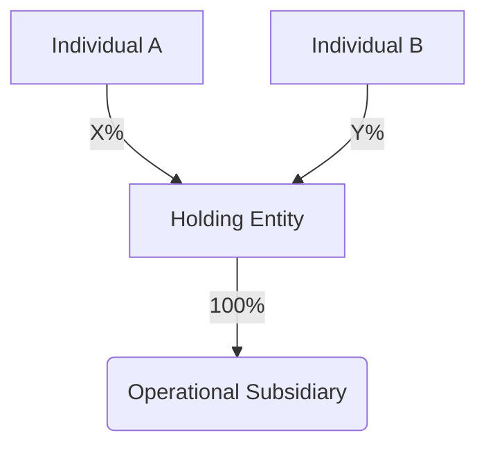

# Corporate Governance & Compliance Report
> **Entity Name:** [CLIENT_ENTITY_NAME]
> **Reporting Period:** [YEAR]
> **Governing Jurisdiction:** [DIFC/ADGM/Mainland]

---

## 1. Ultimate Beneficial Owner (UBO) Status
| Name | Identification | Ownership % | Control Type |
| :--- | :--- | :--- | :--- |
| [NAME] | [ID_NUMBER] | [XX%] | [Direct/Indirect] |

*Verified against Ministerial Decree No. (109) of 2023.*

---

## 2. Economic Substance Regulation (ESR) Compliance
- **Relevant Activity Detected:** [Yes/No]
- **Activity Type:** [e.g., Holding Company / Banking / Distribution]
- **Substance Assessment:** [Met/Not Met]
- **Board Composition:** [List Board Members & Meeting Frequency]

---

## 3. Structural Physics Diagram

---

*(Generated by Sentinel-Legal | OMEGA-GOVERNANCE v1.0)*
