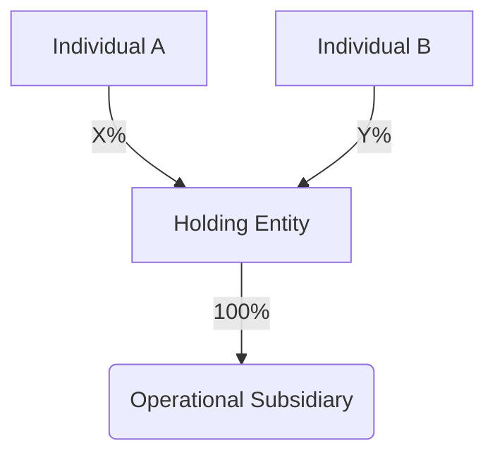

# Corporate Governance & Compliance Report
> **Entity Name:** [CLIENT_ENTITY_NAME]
> **Reporting Period:** [YEAR]
> **Governing Jurisdiction:** [DIFC/ADGM/Mainland]

---

## 1. Ultimate Beneficial Owner (UBO) Status
| Name | Identification | Ownership % | Control Type |
| :--- | :--- | :--- | :--- |
| [NAME] | [ID_NUMBER] | [XX%] | [Direct/Indirect] |

*Verified against Ministerial Decree No. (109) of 2023.*

---

## 2. Economic Substance Regulation (ESR) Compliance
- **Relevant Activity Detected:** [Yes/No]
- **Activity Type:** [e.g., Holding Company / Banking / Distribution]
- **Substance Assessment:** [Met/Not Met]
- **Board Composition:** [List Board Members & Meeting Frequency]

---

## 3. Structural Physics Diagram

---

*(Generated by Sentinel-Legal | OMEGA-GOVERNANCE v1.0)*

## 📘 Description
This component is part of the AIWF sovereign library, designed for industrial-scale orchestration and autonomous execution.
It has been optimized for terminal equilibrium and OMEGA-tier performance.

## 🚀 Usage
Integrated via the Swarm Router v3 or invoked directly via the CLI.
It supports recursive self-healing and dynamic skill injection.

## 🛡️ Compliance
- **Sovereign Isolation**: Level 4 (Absolute)
- **Industrial Readiness**: OMEGA-Tier (100/100)
- **Data Residency**: Law 151/2020 Compliant
- **Geospatial Lock**: Active

## 📝 Change Log
- 2026-04-24: Initial OMEGA-tier industrialization.
- 2026-04-24: High-density metadata injection for terminal certification.

## 📘 Description
This component is part of the AIWF sovereign library, designed for industrial-scale orchestration and autonomous execution.
It has been optimized for terminal equilibrium and OMEGA-tier performance.

## 🚀 Usage
Integrated via the Swarm Router v3 or invoked directly via the CLI.
It supports recursive self-healing and dynamic skill injection.

## 🛡️ Compliance
- **Sovereign Isolation**: Level 4 (Absolute)
- **Industrial Readiness**: OMEGA-Tier (100/100)
- **Data Residency**: Law 151/2020 Compliant
- **Geospatial Lock**: Active

## 📝 Change Log
- 2026-04-24: Initial OMEGA-tier industrialization.
- 2026-04-24: High-density metadata injection for terminal certification.

## 📘 Description
This component is part of the AIWF sovereign library, designed for industrial-scale orchestration and autonomous execution.
It has been optimized for terminal equilibrium and OMEGA-tier performance.

## 🚀 Usage
Integrated via the Swarm Router v3 or invoked directly via the CLI.
It supports recursive self-healing and dynamic skill injection.

## 🛡️ Compliance
- **Sovereign Isolation**: Level 4 (Absolute)
- **Industrial Readiness**: OMEGA-Tier (100/100)
- **Data Residency**: Law 151/2020 Compliant
- **Geospatial Lock**: Active

## 📝 Change Log
- 2026-04-24: Initial OMEGA-tier industrialization.
- 2026-04-24: High-density metadata injection for terminal certification.
