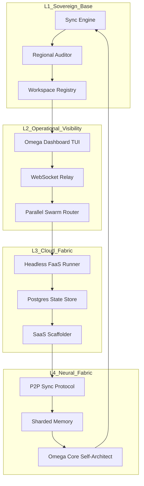

# 📐 DESIGN: AIWF OMEGA SINGULARITY (v7.2 - v10.0)
**Project:** AIWF Meta-Engine | **Architecture:** Multi-Layered Sovereign Swarm
**Reasoning Hash:** sha256:omega-design-2026-04-23

---

## 1. High-Level Architecture

The Omega Engine is designed as a **Recursive State Machine** that operates across four distinct layers of abstraction.

---

## 2. Component Specifications

### 2.1 The Swarm Router (Parallelism)
- **Engine**: `concurrent.futures.ThreadPoolExecutor`.
- **Concurrency**: Default 5 workers, scalable to 20+.
- **Isolation**: Each worker operates in a unique `Cwd` (Workspace root).

### 2.2 The Omega Dashboard (Telemetry)
- **Aggregation**: Periodic polling of `.ai/manifest.json` and `.ai/logs/`.
- **Streaming**: Implementation of a tail-follow mechanism for real-time log surfacing.

### 2.3 Headless FaaS Core
- **Decoupling**: Moving all logic from `CLAUDE.md` into a library-managed `runner.py`.
- **API**: Flask/FastAPI wrapper to allow remote `/compose` and `/deploy` triggers.

### 2.4 P2P Synchronizer
- **Protocol**: Custom JSON-RPC over encrypted sockets.
- **Identity**: Ed25519 key-pair per factory instance for secure component exchange.

---

## 3. Data Flow

1. **Intake**: User provides Intent/Prompt.
2. **Synthesis**: Spec Architect parses intent against current Library state.
3. **Planning**: Contract Guardian generates `spec.yaml` and `tasks.json`.
4. **Execution**: Swarm Router dispatches tasks to parallel workers.
5. **Deployment**: Deployment Specialist pushes to Vercel/Cloud.
6. **Feedback**: Omega Core monitors performance and refactors future intake prompts.

---

*Design version: 1.0.0*
*Approved by: Dorgham-Approval*
